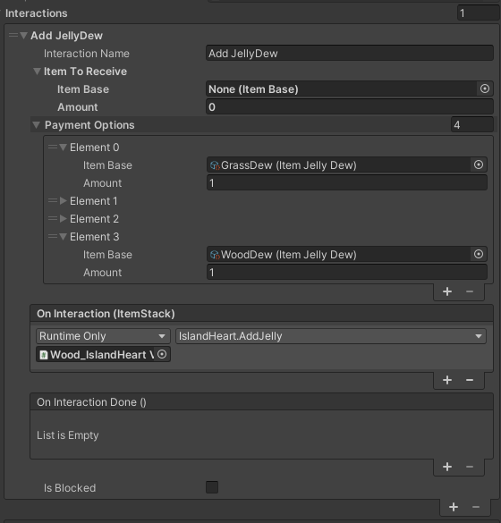

# The interaction System

For the player to be able to interact with any object (slimes, benches, bushes) they need to have an Interactable component attached.

### How it works

The PlayerInteractionFinder script uses a Raycast from the player Transfrom to detect any Gameobjects with Interactable components.
When it finds one it triggers the StartLookingAt() UnityEvent on the Interactable Script which activates the InteractionsViaInputActions script, this script handles the UI prompt, the interaction triggering and the button prompts.

### The Interaction

The Interactable.cs, PlayerInteractionFinder.cs and InteractionsViaInputActions.cs all use the Interaction Class.
Let's break down what that Class contains.

> The name of the interaction. This also appears in the in-game UI.
> What item the player will receive upon completing the interaction (Use only in specific cases).
> The item that the player needs to hold and give for the interaction to happen (Item is consumed upon interaction).
>> There can be multiple payment options.
> Two events that can invoke functions set in the inspector or by code.
>> The first event can transfer the item that was used to trigger the interaction if the function accepts ItemStack arguments.
>> Both events can be left null without any errors showing.
> The isBlocked checkbox will disable the specific interaction.
>> The Interactable component can hold multiple interactions so this can be usefull.