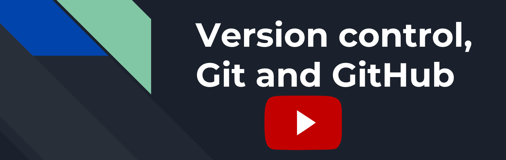
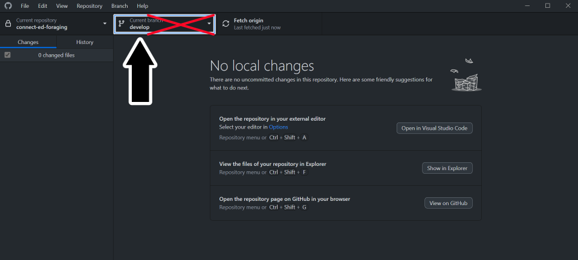
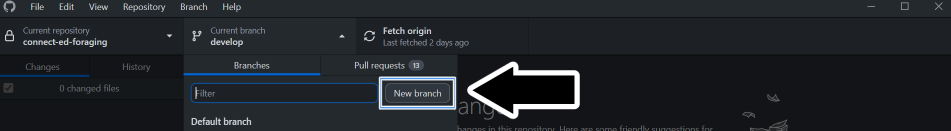
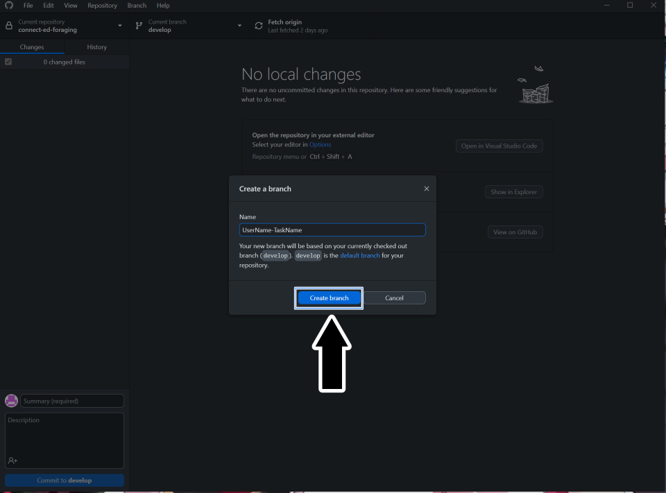
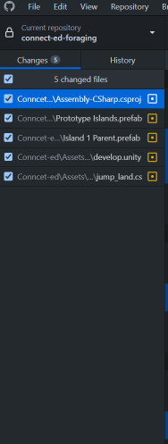
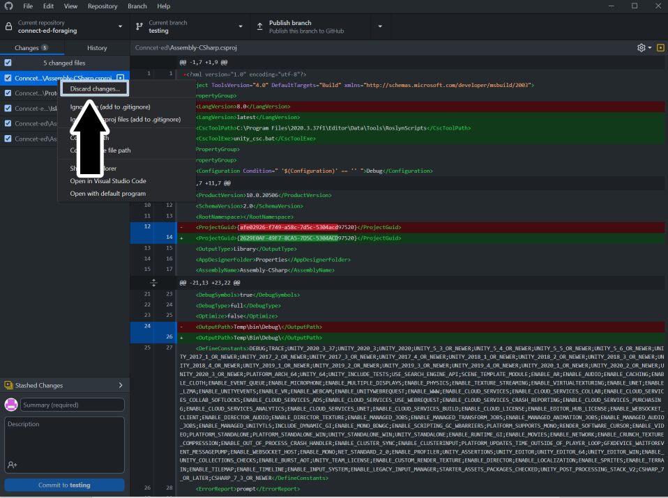
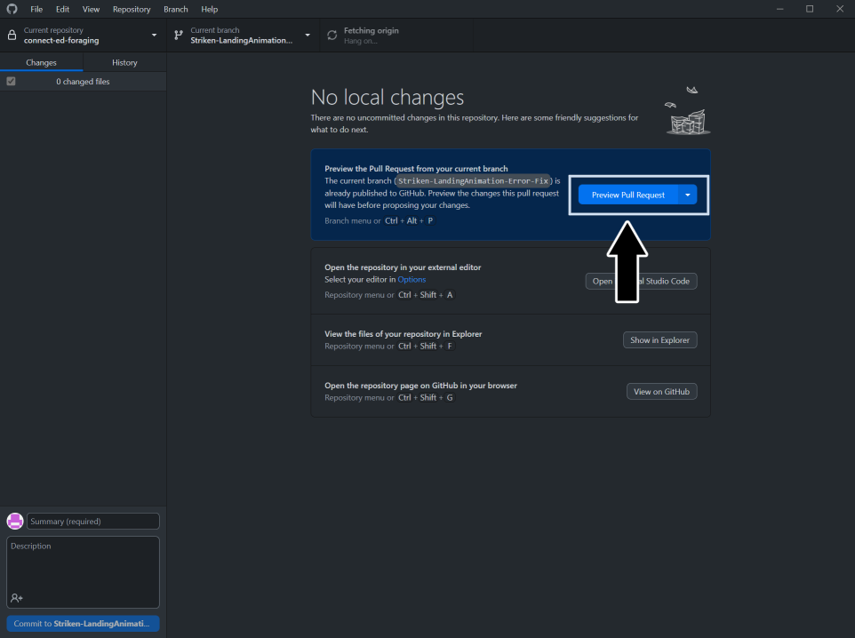
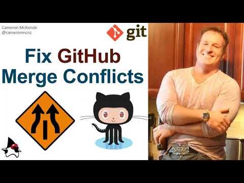
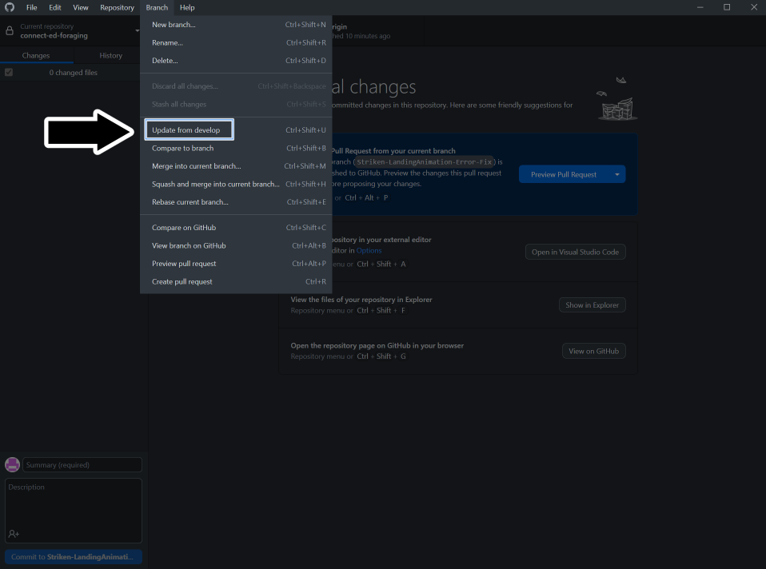

# GitHub - Overview and Installation

GitHub is a distributed source control tool that uses the Git language.
For a presentation on source control and GitHub, click the banner to watch Traba's presentation or click <a href="https://P1Gaming.github.io/P1-OM-Info/Programming/Version%20Control%2C%20Git%20and%20GitHub.pptx">**HERE**</a> to download the presentation for leisurely viewing.

### Traba's Git Seminar by P1-OM

## Why we use GitHub

As mentioned in the introduction, we use GitHub repositories for handling source control. Source control is a means for a mass collective to contribute to a project without ruining the main version of the project. We contribute to the main development without editing the main development.
P1 already has a GitHub setup, so that is why we use GitHub over something like Perforce.

## How we use GitHub

There are a few various methods of interacting with GitHub repositories. The command line is the least attractive way of doing it but it is the foundation of all the other ways. In IDE's such as Visual Studio, if you open a Github project there are tools built-in to help you. Also, Github has created their own application called GitHub Desktop.

For ease of use and quick startup for everyone we recommend using GitHub Desktop. This guide will be referencing Github Desktop in detail.
The video below shows how easy it is to get started with GitHub and GitHub Desktop for Unity projects. (It includes the whole process from  setting up your own repository, creating a gitignore, and commiting.)

As a **new member** your main concern will be **installing GitHub Desktop** (or using your preferred method) and **cloning our project**

If you are interested in using  command line or just learning as well, Click *[HERE](#using-command-line)*

If you need to gain access, your point of contact will be Samuel Martin. You can send them a direct message in Discord asking them to gain access to either of the repositories you need access to (Most likely the prototype at first unless joining a Crew). Ensure to include the email you use for GitHub, as they need that to add you.

## Creating a new branch

You cloned the project and you're ready to start working on your task...

 STOOOOOOOOOOOOOOOOOOP

 **Important** , Make sure you did not fork the project instead of cloning

Forking the project is similar to cloning and you are able to do all the of the next steps without knowing. When you fork the project you create a copy of the project that was forked. That in itself isn't bad, but you will not receive any of the changes other programmers merge into the original project. If you commit any changes to your forked project the original project will never see them.

 **Important** , Make sure you are working on a different branch and not the main branch.

This is a red flag if you find yourself on the branch shown in the image below. Do not make any direct changes to this branch.

What you should do instead is create a new branch from that branch.

With your new branch ready, you can publish it for everyone to view. Or you can decide not to publish it if you want to test several things. But for handling your tasks, you should publish the branch since it will need to be reviewed later.
Note: You should follow a naming convention for your branch. Example: YourDiscordName-Task

## Making Changes
When you change the project, it will appear like the image below in GitHub Desktop.

These changes are not saved in the GitHub branch yet. To do that, you need to commit these changes, and it is required to have a commit summary title. Although you do not need a description, you should add one for others to know what changes you have made in this commit. Once you have hit the commit button, you must push those changes before they go live.

We have changed a Unity Scene, a C# script, and others in the image above. Now you can “commit” these changes, but that can lead to problems such as conflicts. Let us say, for example, your task has you making a change or functionality to the C# script that is listed. Every other change does not impact that script change. You can safely delete those changes, which is HIGHLY recommended. This way, you only commit changes that are part of your task.

To delete a change, click on one of the changes (that you do not need) in GitHub Desktop and select discard changes.

## Making Pull Requests (PR)

A Pull Request, or PR, is a request to pull the changes you made on your branch with the main develop branch. Putting it simply, it is a merge request.

When you’ve completed a task, you might think, “Now what?” For programmers in P1-OM, we handle task reviewing a bit differently. Ultimately, we require a Pull Request, shortened to PR, to be made for review.

## Creating a Pull Request (PR)

Once you complete your task push your changes, publish your branch, and create a PR. Someone will review and merge it or request changes.

To create the PR, you can click on the create or preview Pull Request button in GitHub Desktop.

It will let you know if the merge can safely happen before creating the Pull Request. Otherwise, you may have to clear out a conflict (more on that below).
 
After clicking on the option to create a PR in GitHub Desktop, it will take you to the GitHub website for you to officially create the PR. You will need to fill out the description and a name for the PR. The form will ask for a link to the Pull Request Card.

The video below has all the steps:

## Creating the Pull Request Card

Once you have reached the Pull Request step, you are ready to make the card for it. P1-OM uses Trello to handle all task management. Before making the PR, you should have had some time to look through the Action Trello Board and get acquainted with it. Regardless, when creating a PR, you create a new task for the programming team to handle. A task that requires someone else to review than yourself.

To create the PR Card, follow this link to the PR Card template: *[template](https://trello.com/c/r4UJnCIK)*

You can follow the steps on that card, but the general steps are as follows.

1. Copy from the template (rename the card to "PR: your task name")
2. Move the card to the "To Do" column under the "PROGRAMMING (Pull Requests)" section.
3. Fill out the information: it needs the link to the task you worked on and the Pull Request.
4. Use the share button to copy the card link to the form in GitHub, so it has a link to the card for you to officially create the PR.
5. Copy and paste the PR URL from GitHub to the PR card.
6. Do NOT join this card. The card is a created task that requires someone else to handle.
 
You officially made a Pull Request and a PR card on Trello for your task. Good work and Congratulations!

## Handling Conflicts

You might end up in a situation where the changes you made conflict with a different set of changes. Ideally, this will not occur if we push changes only for our tasks. But you may run into this issue.

After creating the Pull Request, you can check to see if there are conflicts. And if there are, you will need to go and resolve the conflicts. Visual Studio Code is an excellent way to resolve conflicts.

## GitHub Extras
Here are a few extra details that are not necessary to the project but could be good to know.
 
At any time, you can update the main project. Say you are working on a task and found some neat changes and wanted to see how that could apply to your task. You can do this by following the image below.

 **Important** , updating from the main branch can and will overwrite changes you made if any modifications were made to that file in the main branch.
 
You can also view the history of commits to the repository in the history section. This can be useful for testing previous versions. You can create a new branch from any of the changes found in history.

### Using Command Line
download git: *[HERE](https://git-scm.com/downloads)*

git documentation: *[HERE](https://git-scm.com/docs)*

-*Documentation soon*-