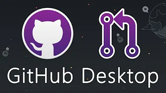

# GitHub

GitHub is a source control tool that uses Git.

## Installing GitHub Desktop

You can use GitHub through the command line but the easier way is to download and use the GitHub Desktop application.
Follow the video below (It explains the whole process from  setting up a repository, creating a Gitignore and commiting.)
**You only care about installing and cloning for now.**

## Creating a new branch

You cloned the project and you're ready to start working on your task...

 STOOOOOOOOOOOOOOOOOOP

Did you create a new branch??????		
Go to branch -> New branch   
Once you do that you are ready to start working.	

## Creating a Pull Request (PR)

Once you complete your task push your changes, publich your branch and create a PR. Someone will review it and merge it or request changes.
Don't forget to create a PR card on the trello board.

The video below has all the steps:

