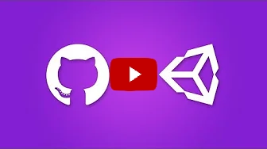

# GitHub

GitHub is a distributed source control tool that uses the Git language.
You can click <a href="https://P1Gaming.github.io/P1-OM-Info/Programming/Version%20Control%2C%20Git%20and%20GitHub.pptx">**HERE**</a> to download a presentation on Source control and GitHub.

## Installing GitHub Desktop

You can use GitHub through the command line but the easier way is to download and use the GitHub Desktop application.
Follow the video below (It explains the whole process from  setting up a repository, creating a Gitignore and commiting.)
**You only care about installing and cloning for now.**

## Creating a new branch

You cloned the project and you're ready to start working on your task...

 STOOOOOOOOOOOOOOOOOOP

- Make sure you did not fork the project instead of clone
- Did you create a new branch??????		
- Go to branch -> New branch, Once you do that you are ready to start working.	

## Creating a Pull Request (PR)

Once you complete your task push your changes, publish your branch and create a PR. Someone will review it and merge it or request changes.
- Don't forget to create a PR card on the Trello board. Use this Trello template card for PR's: *[Template](https://trello.com/c/r4UJnCIK/434-pull-request-card-template-dont-delete)*

The video below has all the steps:

## Traba's Git Seminar by P1-OM

