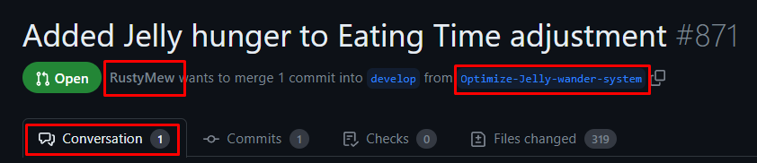
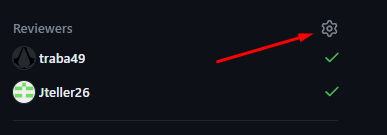
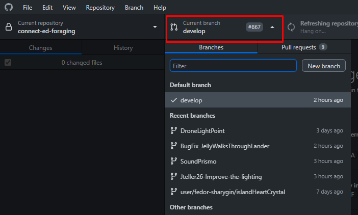

# Pull Requests (PR)

A request to Merge changes from one branch to another, usually the master branch.

## How to do them

- [Step 1: Open the PR on GitHub](#open-the-pr-on-github)
- [Step 2: Check the files changes](#check-the-files-changes)
- [Step 3: Open the branch in GitHub Desktop](#open-the-branch-in-github-desktop)
- [Step 4: Playtest the changes in Unity](#playtest-the-changes-in-unity)
- [Step 5: Approve and merge](#approve-and-merge)

## Open the PR on GitHub

Go to our repo on GitHub and click the PR tab.
Find the PR that you want to review.
Read comments, see who made it, remember to see what is the name of the branch (image 1a).
If you want to be profesional add yourself as a reviewer (image 1b).

 
## Check the files changes
If you want to do this right, you need to go and check what files have been changed.
If for small changes the number of files altered is large, that's a red flag.
If for big changes the number is small, that is also a red flag.
If you are a programmer you have a detailed list of all the code lines that changed.

## Open the branch in GitHub Desktop
Hope you checked the branch name because now we need it.
Open GitHub Desktopand open the branch list (image 3a).
Fine the branch and open it, wait for it to load.

## Playtest the changes in Unity
Now open or refresh the Unity project.
Press play and test out whatever you need.
If some thing doesn't work leave a comment on GitHub about it.
If everything works move to the next step.

## Approve and merge
If you are a designer just leave a comment that all is good.
If you are a programmer follow the instructions of the respective project review.
- [Compassion Prototype](./CPrototype.md)
- [Full game]()