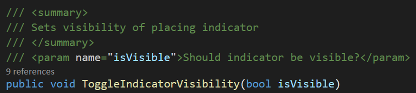

# Style Guide

## General info
- Don't be afraid to type. Your variable name can be 100 characters long, as long as it explains what it does it's fine.
- Don't hardcode values. Even if it shouldn't appear in the inspector declare it in a variable.
```csharp
// Do this
private const _thisVariablesDoesThis = 5; //Unmodifiable

private Function()
{
	// Here we know what both variables are.
	thisVariableDoesSomething += thisVariablesDoesThis; 
}
// Don't do this
private Function()
{
	thisVariableDoesSomething += 5; // Why are we increasing it by 5?
}
```
- Don't add stuff about petting jellies in the Jelly_Bath script. Scripts that carry more than one functionality are confusing and prone to breaking.
- Make it good, not perfect. Perfect code does not exist.

## Variables

- Use camelCase to name variables.
- Private variables should start with an underscore(_).
- If your variable is a boolean the name should be asking a question.
- Avoid special characters, it can affect how the editor reads the names.

```csharp
// Do this
private int _healthPoints;
private bool _hasItem;

//Don't do this:
private int PlayerChar;
private bool A;
private string PSText;
```

### Privacy

Try to keep your variables as private as possible. That way we have better control of when and how scripts alter them.
There is no harm in accessing a variable from another class. Be more concerned about changing the value from another class.

<details>
  <summary> Examples Click Here </summary>
  
```csharp
// Do this
private int _variable; // safest approach
[Serialized Field] private int _variable; // Can be altered in the inspector

//working with properties (getters and setters)

private int _variable;
public int Variable 
{
	get {return _variable;} // can be read from anywhere
	private set {_variable=value;} // set from this class only
}

[field:SerializeField] public float MyFloat3 { get; private set; } // same as above, but Unity creates a backupfield so you can set it in the inspector
```
</details>

### Lambda Expression ( => )

Lambda expressions in C# are used like anonymous functions, with the difference that in Lambda expressions you don’t need to specify the type of the value that you input thus making it more flexible to use. 
The ( => ) is the lambda operator which is used in all lambda expressions. 
The Lambda expression is divided into two parts, the left side is the input and the right is the expression.

<details>
  <summary> Examples Click Here </summary>
For example:

```csharp
public Float CurrentHealth => (energy * baseHealth)-damage;
```

Acts like a function with body:

```csharp
{
  return (energy * baseHealth)-damage;
}
```

But you can call it without brackets though, like :
```csharp
 if(CurrentHealth > 0)
```
</details>

## Functions
- Function names will use **PascalCase**.
- If it's a boolean name should be asking a question. Example:
```csharp
private void IsPlayerDead()
{
	//Do stuff
}
```


## Events
If a function triggers an event it's name should start with a OnEventName.
Example:
```csharp
private void OnDoorOpened()
{
	//Do stuff
}
```

## Brackets
When you make if statements **don't** omit the braces. It makes the code more confusing.
```csharp
// Do this
if()
{
	//Do stuff
}

while()
{
	//Do stuff
}

//Don't do this
if()
	//Do stuff
	
While() //Do stuff
```

## Classes
The functions within classes should be arranged in a specific order.

```csharp
public class ClassName : MonoBehaviour
{
	Variable Declarations
	Enum Declarations
	
	Unity Events
	- OnValidate()
	- OnEnable()
	- Awake()
	- Start()
	- Update()
	
	Private Functions
	
	Public Functions
	- Custom functions
	- Get/Set Methods
	
}
```

## Comments
Don't use comments to explain what your code and variables do. Clean code explains itself.
Most of the time comments should explain **WHY** the code does someting **NOT HOW**.
> If you want to add info on a variable consider using the `[tooltip]` attribute.

> You can add XML tags to describe what a function does.
>
>


