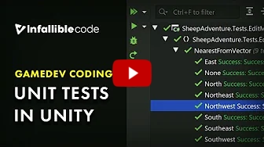

# Unit Testing

A unit test is a way of testing a unit - *the smallest piece of code* that can be logically isolated in a system. 
In most programming languages, that is a function, a subroutine, a method or property.
The isolated part of the definition is important.  

It is a way to automatically test if the output of your code is the expected one.

## Why and What Unit Testing

Now you think:  *Why should I set up a Unit Test. It's extra effort and besides I can just press play and test it*  

There are many advantages to Unit testing.
- Allows you to test parts of the code that might not be playable for some reason.
- Allows you to test the functions in a void, meaning that: 
	- in a chain of functions you can find easilly where the problem lies.
	- you do not depend on other functions.
- Once set up you can quickly test with different inputs.

This  **does not mean** that you stop testing your work in-game.

Now you think:  *What should I test, everything?*

 **This is a difficult question.**  
There are thing that you should test, that you shouldn't test and things you cannot test.
The best thing you can do is think critically and experiment yourself.

## Unit Testing in Unity

Unity has it's own libraries and tools to help set up all the tests you need.
For more info [*Click Here*](https://docs.unity3d.com/Manual/testing-editortestsrunner.html)

Also here's a video:  
