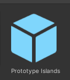
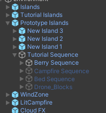

# Unity

To create our game we use Unity (you already know that).
Specifically:

### Compassion Prototype
The Compassion Prototype is where we prototype features that may or may not be in the final product. After the Join Task, your first tasks will most likely be from the prototype unless you will be joining a Crew. The style guide is ot enforced here but is highly encouraged to follow it anyway. To learn more about the Compassion Prototype check out this section: *[HERE](./CPrototype.md)*. To learn more about Crews check this out: **link added soon**
- The Unity version for the prototype is 2020.3.37f1 (You didn't know that).
- If you don't have it you can download it *[HERE](https://unity.com/releases/editor/whats-new/2020.3.37)*. 
Don't use other versions, yes I know 2020.3.34f1 is 99% the same, it cause problems.

### Full Game/Production
The full production game is where all the teams best work will end up and be finalized. The style guide is strictly enforced for optimal readibility and cohesiveness. With the addition of Crews, they will be focusing on smaller manageable parts for the full game.  
- The Unity version for the full game is 2021.3.20f1 (You also didn't know that).
- If you don't have it you can download it *[HERE](https://unity.com/releases/editor/whats-new/2021.3.20)*.

The video below has detailed instructions if you need them.

# Prefabs and the develop scene 

The develop scene is the main scene we use and is compromised of multiple prefabricated objects (prefabs for short).
They have a blue color in the hierarchy.

When making changes to a prefab you need to find the object in the project files or open it from the inspector and do the changes there,  **not in the develop scene directly** .
If the prefab contains other prefabs inside it, keep opening them.

Prefab Documentation: [Unity's Documentation](https://docs.unity3d.com/Manual/Prefabs.html)