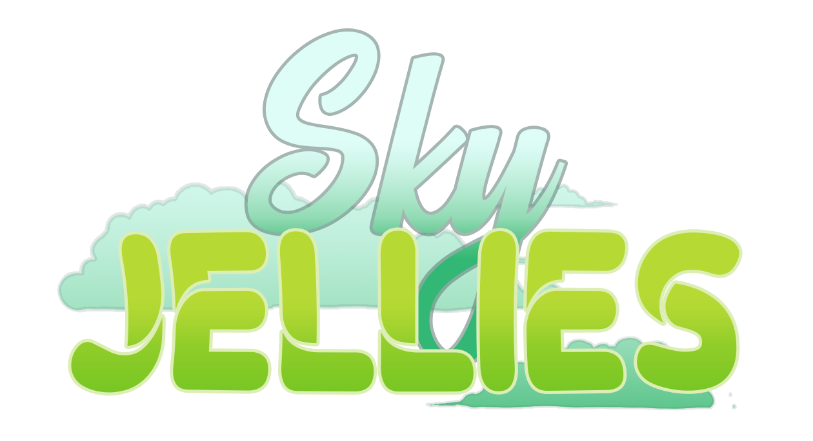

# Programming Team Guide

## Welcome to the programming team

This document contains instructions and information to assist you in an easy transition as a programmer within P1-OM. We are focused on your growth as a programmer and member of P1-OM and are not concerned of your skill level. If you have the interest and the determination to be a programmer or you just want to be a hobbyist, both are acceptable. We ask only, if you say you are going to do a task, follow through with your task. 

Excluding the Join Task, if you have any questions about anything regarding this documentation, P1-OM, or programming questions for our projects or any personal projects do not hesitate to ask. There are no stupid questions and if someone doesn't have an answer, they will at least point you in the right direction to find your answer.

## What is the game

Sky Jellies is a game that aims to bridge a sandbox craft game, like Minecraft, and combine it with a wholesome pet-type game. The player befriends different kinds of Jelly creatures that help them progress in building resources to explore and build in the game world.

## Why two projects and their differences

For us developers in P1, there are two types of “builds” we currently develop. These are the Compassion Prototype and the Full Game. Understanding the differences at first might be tricky, but here is the essential breakdown.
 
- ### Compassion Prototype

    - This is a build that we can use to showcase to everyone the type of game we are developing. It allows most of us to “prototype” a concept and see the reactions from others before implementing it into the main game. Most of the development is not clean and advanced, which is fine for the prototype.

- ### Full Game

    - This will be the eventual game for Sky Jellies. Perhaps it does not look like much, but it will eventually be deployed with advanced and final variations from the Prototype.
 
For those familiar with GitHub, these builds have their own respective repository. The Prototype is listed as Connect-ed-foraging, and the Full Game is listed as SkyJellies on GitHub.
 
It is important to note that the Prototype and the Full Game have their own rules when developing for them. Please follow those guides, which are listed in the respective sections.
- Prototype: *[HERE](./Programming/CPrototype.md)*
- Full Game: *[HERE](./Programming/FullGame.md)*
