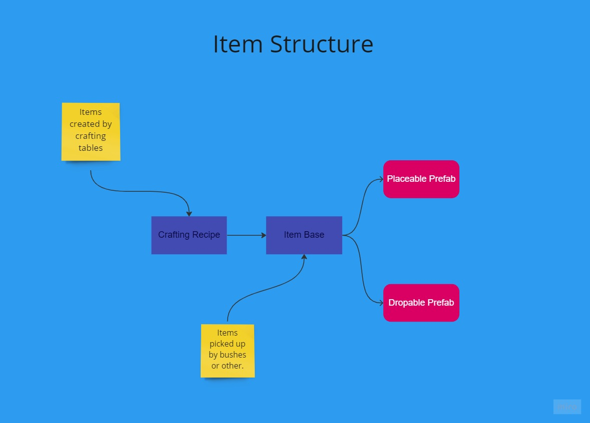

# Item structure

We use the base class ItemBase to create items as scriptable objects.
From there we have various classes that inherit the ItemBase to create more specialized item categories like placeable or the jelly dew.

Items are added to the player inventory either directly (from the interaction system or crafting) or from picking pickable prefabs objects.

Items must contain:
	- a reference to an icon asset that will be displayed at the player's inventory.
	- a reference to a placeable prefab object if the item can be placed down
	- a reference to a dropable prefab object which the player can pick up
	

# Crafting Recipes

Crafting recipes contain a reference to the ItemBase scriptable object they create, the materials and the amount needed.

> Folder structure:
> Assets -> ScriptableObjects -> Crafting Recipes -> Folder named after the workbench that will contain the recipe